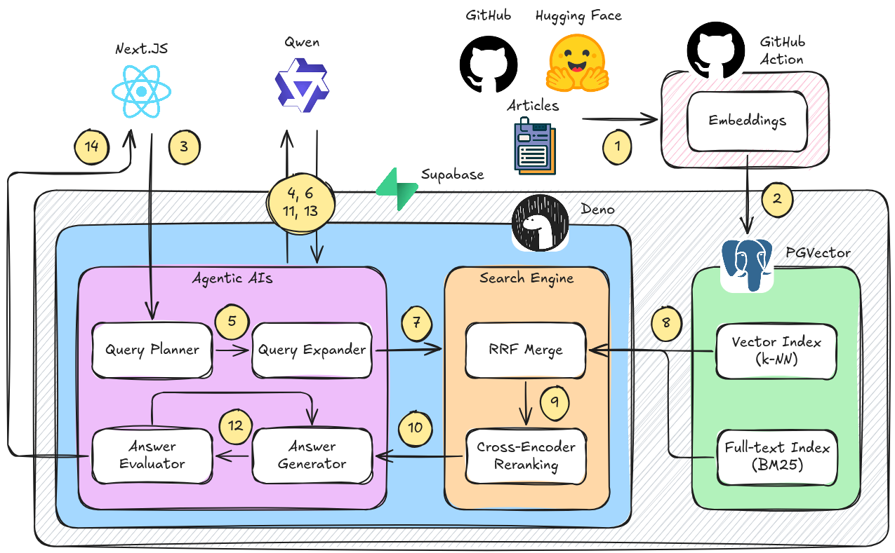

<div align="center">
  

  # RAGnosis

  > **Agentic AI system for RAG technology intelligence**

  **[🚀 Now Live](https://www.ragnosis.app)**
</div>

A production RAG system that answers questions about RAG technology itself, combining quantitative metrics from HuggingFace and GitHub with expert knowledge from official documentation. Built to showcase sophisticated RAG patterns that go beyond basic vector search.

**What makes this interesting:** Most RAG tutorials do naive vector search and call it done. This system demonstrates agentic planning, hybrid search, RRF fusion, and cost optimization techniques you need for production systems.

## Architecture Overview

<div align="center">
  
</div>

### Flow:
**1.** Data Collection - GitHub Actions scrapes docs, fetches HuggingFace/GitHub metrics<br/>
**2.** Embedding Pipeline - Python processes content and generates vector embeddings<br/>
**3.** User Query - Next.js frontend sends questions to Deno edge function<br/>
**4-5.** Query Planning - LLM analyzes user intent and generates doc_type routing weights<br/>
**6-7.** Query Expansion - LLM creates semantic variations (optional, disabled by default)<br/>
**8.** Hybrid Search & RRF Merge - Parallel vector and keyword searches combined via weighted fusion<br/>
**9.** Reranking - Optional cross-encoder refinement (feature-flagged)<br/>
**10-11.** Answer Generation - LLM synthesizes context-aware response with citations<br/>
**12-13.** Answer Evaluation - LLM scores quality (relevancy, accuracy, clarity, specificity)<br/>
**14.** Streaming Response - Progressive results sent back to frontend

---

## Why It's Different

| Basic RAG | This System |
|-----------|-------------|
| Jump straight to vector search | **Agentic planning** - LLM analyzes intent, routes to right sources |
| Vector search only | **Hybrid search** - Vector + keyword in parallel, RRF merge |
| Return raw results | **Smart fusion** - RRF scoring, optional cross-encoder |
| Generic answers | **Context-aware** - Market lists, how-tos, comparisons |
| Single query | **Query expansion** - 3 variations × hybrid search = 6 parallel searches |

## Agentic Components

| Component | Purpose | Implementation |
|-----------|---------|----------------|
| **Query Planner** | Analyzes user intent | Routes to docs vs metrics; extracts nouns for filtering |
| **Query Expander** | Enhances search coverage | Generates 2 semantic variations (disabled by default) |
| **Answer Generator** | Synthesizes response | Context-aware prompts by intent type |
| **Answer Evaluator** | Quality assessment | LLM-based evaluation (relevancy, accuracy, clarity, specificity) |

**Search Pipeline:**
- Query expansion creates 3 variations (original + 2 semantic alternatives)
- Each variation performs hybrid search: 50 from vector + 50 from keyword
- RRF merge across all results with weighted fusion (60% vector, 40% keyword)
- Optional cross-encoder reranking (feature-flagged)
- Return top 20 results

**Data:** 3K+ doc chunks (LangChain, LlamaIndex, Pinecone, etc.) • 4K+ HF models • 4K+ GitHub repos • Trends data

---

## Event Flow & Data Volumes

<div align="center">
  
</div>

---

## Tech Stack & Tools

### Core Technologies

| Category | Tools | Purpose |
|----------|-------|---------|
| **Languages** | TypeScript, Python 3.13, SQL | Frontend/backend (TS), data pipeline (Python), database (SQL) |
| **Frontend** | Next.js 16, React 19 | Web application framework |
| | assistant-ui, Radix UI, Tailwind CSS 3 | Chat interface, components, styling |
| | Recharts, React Markdown, Lucide React | Analytics charts, markdown rendering, icons |
| **Backend** | Deno, Supabase Edge Functions | Serverless TypeScript runtime with fast cold starts |
| **Database** | PostgreSQL, pgvector, Supabase | Vector + relational data in single DB |
| **Vector Search** | pgvector (HNSW, cosine) | Graph-based vector index, no tuning needed |
| **Keyword Search** | PostgreSQL (GIN + ts_rank) | Native full-text search |
| **Search Fusion** | Reciprocal Rank Fusion (RRF) | Merges vector + keyword with configurable weights |
| **Reranking** | Cross-Encoder (optional) | Feature-flagged semantic reranking |

### AI & ML Stack

| Component | Tools | Details |
|-----------|-------|---------|
| **LLM (Local)** | Ollama, qwen2.5:3b-instruct | Query planning & answer synthesis |
| **LLM (Cloud)** | OpenRouter API | Alternative to local (auto-detects by API key) |
| **Embeddings** | Supabase AI (gte-small) | 384-dim vectors, quality/speed balance |
| | sentence-transformers | Python embedding library |
| **Evaluation** | RAGAS, LangChain, fastembed | Automated quality metrics (faithfulness, relevancy) |

### Data Pipeline

| Component | Tools | Purpose |
|-----------|-------|---------|
| **Language** | Python 3.13 | Data processing & embeddings |
| **Automation** | GitHub Actions | Scheduled scraping & updates |
| **Web Scraping** | BeautifulSoup4, Feedparser, requests | Doc collection, RSS parsing |
| **APIs** | HuggingFace Hub, GitHub API, PyTrends | Model metrics, repo data, trends |
| **Visualization** | Streamlit, Plotly | Data pipeline UI & interactive charts |

### Development Tools

| Tool | Purpose |
|------|---------|
| Docker & Docker Compose | Containerization (Ollama, Supabase) |
| Make | Task automation (setup, pipeline, deploy) |
| ESLint, TypeScript | Code quality & type safety |
| python-dotenv | Environment configuration |
| Git & GitHub | Version control & CI/CD |


---

## Evaluation & Quality Assurance

The system includes a comprehensive evaluation framework with **28 curated test questions** across 6 categories (concepts, models, repos, comparisons, implementation, troubleshooting).

**Key Metrics:**
- **Faithfulness (0.90)** - Answers grounded in sources, minimal hallucination
- **Answer Relevancy (0.55)** - How directly answers address the question
- **Entity Accuracy** - Correct entities mentioned in responses

Uses **RAGAS** (Retrieval Augmented Generation Assessment) framework with Ollama for automated quality scoring. Each code change can be validated against the golden dataset to prevent regressions.

**Run evaluation:** `cd evaluation && python evaluate_ragnosis.py` (~2 min for full suite)

See [`evaluation/README.md`](evaluation/README.md) for detailed metrics and tuning guidance.

---

## Quick Start

```bash
# Setup local environment (Supabase + Ollama + models)
make setup

# Collect data (HuggingFace + GitHub market data)
make pipeline

# Generate embeddings (processes docs into vectors)
make embed

# Run edge function locally
make chat

# Run Next.js frontend
make web
```

See `Makefile` for all commands including evaluation tools.

---

**Built to demonstrate:** Agentic RAG • Hybrid search • RRF fusion • Feature-flagged architecture • Cost optimization
