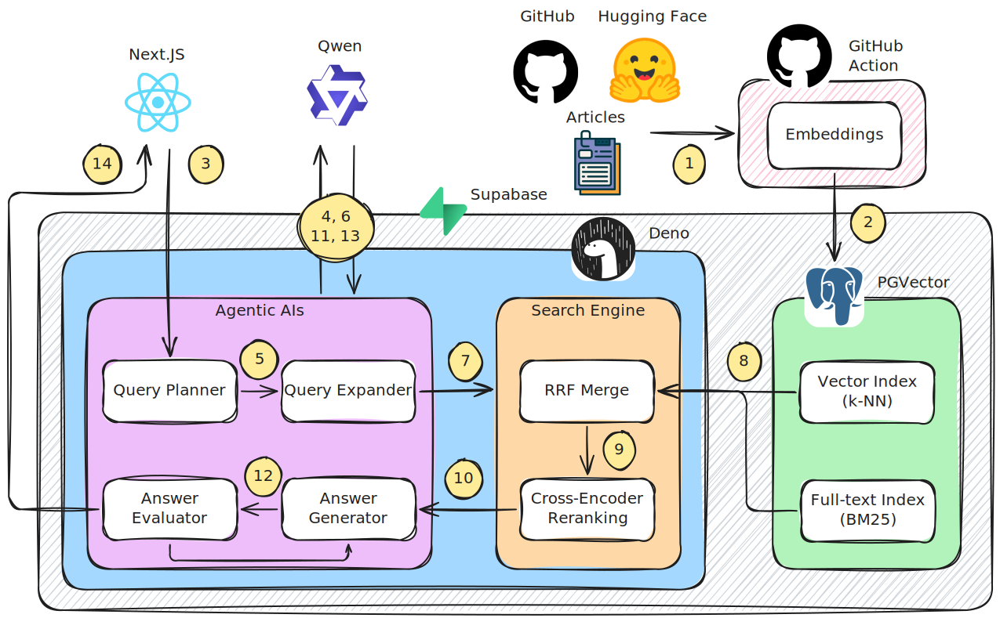
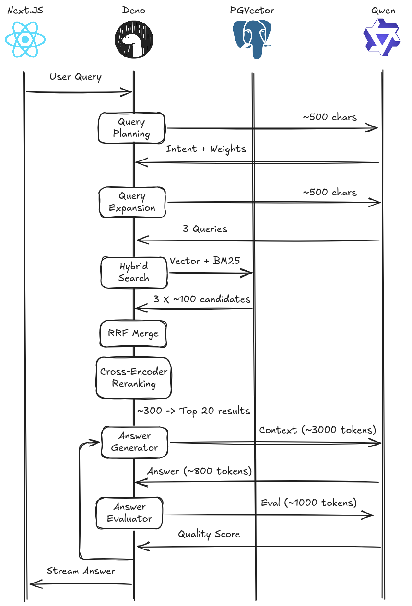

<div align="center">
  

  # RAGnosis

  > **Agentic AI system for RAG technology intelligence**
</div>

A production RAG system that answers questions about RAG technology itself—combining quantitative metrics from HuggingFace and GitHub with expert knowledge from official documentation. Built to showcase sophisticated RAG patterns that go beyond basic vector search.

**What makes this interesting:** Most RAG tutorials do naive vector search and call it done. This system demonstrates agentic planning, hybrid search, RRF fusion, and cost optimization—techniques you need for production systems.

## Architecture Overview

<div align="center">
  
</div>

**Flow:**
1. **Data Collection** - GitHub Actions scrapes docs, fetches HuggingFace/GitHub metrics
2. **Embedding Pipeline** - Python processes content and generates vector embeddings
3. **User Query** - Next.js frontend sends questions to Deno edge function
4. **Query Planning** - Analyze user intent and route to appropriate sources
5. **LLM Planning** - Call LLM to generate intent classification and doc_type weights
6. **Query Expanding** - Generate semantic variations (optional, disabled by default)
7. **LLM Expansion** - Call LLM to create 2 alternative queries
8. **Hybrid Search & RRF Merge** - Parallel vector and keyword searches combined via weighted fusion
9. **Reranking** - Optional cross-encoder refinement (feature-flagged)
10. **Answer Generation** - Synthesize response with proper citations
11. **LLM Synthesis** - Call LLM to generate context-aware answer
12. **Answer Evaluation** - Quality assessment across 4 dimensions
13. **LLM Evaluation** - Call LLM to score answer quality (relevancy, accuracy, clarity, specificity)
14. **Streaming Response** - Progressive results sent back to frontend

### Event Flow & Data Volumes

<div align="center">
  
</div>

---

## Why It's Different

| Basic RAG | This System |
|-----------|-------------|
| Jump straight to vector search | **Agentic planning** - LLM analyzes intent, routes to right sources |
| Vector search only | **Hybrid search** - Vector + keyword in parallel, RRF merge |
| Return raw results | **Smart fusion** - RRF scoring, optional cross-encoder |
| Generic answers | **Context-aware** - Market lists, how-tos, comparisons |
| Single query | **Query expansion** - 3 variations × hybrid search = 6 parallel searches |

## Agentic Components

| Component | Purpose | Implementation |
|-----------|---------|----------------|
| **Query Planner** | Analyzes user intent | Routes to docs vs metrics; extracts nouns for filtering |
| **Query Expander** | Enhances search coverage | Generates 2 semantic variations (disabled by default) |
| **Answer Generator** | Synthesizes response | Context-aware prompts by intent type |
| **Answer Evaluator** | Quality assessment | LLM-based evaluation (relevancy, accuracy, clarity, specificity) |

**Search Pipeline:**
- Query expansion creates 3 variations (original + 2 semantic alternatives)
- Each variation performs hybrid search: 50 from vector + 50 from keyword
- RRF merge across all results with weighted fusion (60% vector, 40% keyword)
- Optional cross-encoder reranking (feature-flagged)
- Return top 20 results

**Data:** 3K+ doc chunks (LangChain, LlamaIndex, Pinecone, etc.) • 4K+ HF models • 4K+ GitHub repos • Trends data

---

## Tech Stack

| Layer | Technology | Why This Choice |
|-------|-----------|-----------------|
| **Frontend** | Next.js + assistant-ui | Streaming UI with thought process visibility, analytics dashboard, source attribution |
| **Backend** | Deno (Supabase Edge Functions) | Fast cold starts, TypeScript-native, simple deployment |
| **Database** | PostgreSQL + pgvector | Hybrid search in one DB, no separate vector store needed |
| **Vector Search** | pgvector HNSW (cosine) | Graph-based index, consistent performance, no tuning needed |
| **Keyword Search** | PostgreSQL GIN + ts_rank | Native full-text search, combines with vector via CTEs |
| **LLM** | Ollama qwen2.5:3b / OpenRouter | Query planning & synthesis, auto-detects based on API key |
| **Embeddings** | Supabase AI (gte-small) | 384-dim, quality/speed balance, serverless |
| **Fusion** | Reciprocal Rank Fusion (RRF) | Merges vector + keyword results with configurable weights |
| **Reranking** | Optional Cross-Encoder | Feature-flagged semantic reranking using gte-small |
| **Data Pipeline** | Python 3.13 + GitHub Actions | Flexible scraping, automated scheduling |

## Quick Start

```bash
# Setup local environment (Supabase + Ollama + models)
make setup

# Collect data (HuggingFace + GitHub market data)
make pipeline

# Generate embeddings (processes docs into vectors)
make embed

# Run edge function locally
make chat

# Run Next.js frontend
make web
```

See `Makefile` for all commands including evaluation tools.

---

**Built to demonstrate:** Agentic RAG • Hybrid search • RRF fusion • Feature-flagged architecture • Cost optimization
